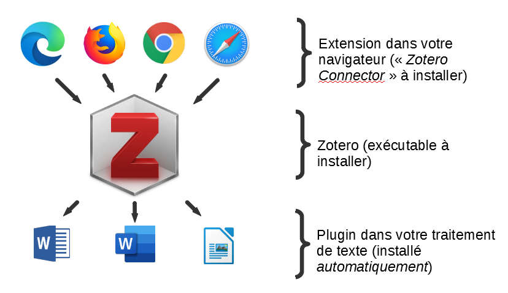
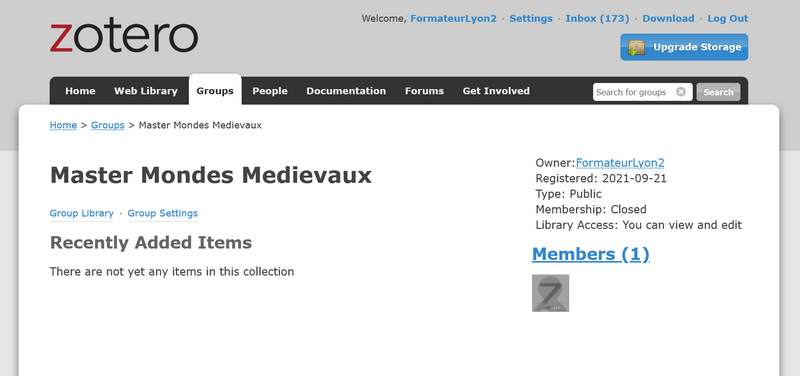

# Formation Zotero - Initiation - Master Mondes Médiévaux - sept 2021

## Installer Zotero

Installer un environnement de travail complet basé sur Zotero consiste à :

1. installer le *logiciel Zotero* (.exe sous windows, .dmg sous MacOS; linux est également supporté) sur son poste informatique
2. installer un second élément, le « Zotero connector », qui est une *extension de votre navigateur web* qui va faciliter la collecte de références
3. vérifier qu’un 3e élément, le *plugin* Zotero pour traitement de texte, s’est installé automatiquement dans votre traitement de texte préféré (Word, LibreOffice)

Dans un second temps, il est recommandé (car très utile) de se créer un compte sur le site zotero.org, mais *cela n'est pas indispensable* à l'utilisation du logiciel Zotero. Sachez cependant que créer un compte sur Zotero.org permettra : 

1. une synchronisation de vos références entre plusieurs Zotero si vous utilisez plusieurs postes de travail
2. un travail collaboratif autour des références bibliographiques au sein de groupes
3. un premier niveau de sauvegarde de vos données

Pour créer un compte Zotero : https://www.zotero.org/user/register/ (en cas de login-password oublié : https://www.zotero.org/user/lostpassword)

## Avant la séance en présentiel : 
Nous vous demandons de *procéder à l'installation du logiciel Zotero et du Connector* (l'extension dédiée pour navigateur), afin de gagner du temps.

**Pour télécharger le logiciel** : 

1. se rendre sur le site Zotero.org : https://www.zotero.org/download/
2. cliquer sur  "Zotero 5.0 for" (...Windows ou ...MacOS, selon votre système) pour télécharger l'exécutable
3. lancer l'exécutable .exe ou .dmg une fois téléchargé et installer l'application en suivant l’assistant d'installation

Dans la foulée, et si vous optez pour ouvrir Zotero juste après l'installation (comportement par défaut), le logiciel lancera votre navigateur web par défaut (donc pas nécessairement celui que vous utilisez couramment) et ouvrira la page dédiée au téléchargement de l'extension (Zotero Connector) à l'adresse https://www.zotero.org/download/connectors, donc : 

- si vous êtes sur votre navigateur favoris (parmi : Safari, Edge, Firefox, Chrome), très bien : installez l'extension proposée en cliquant sur "Install" et en acceptant l'installation de l'extension dans votre navigateur
- si vous préférez utiliser un autre navigateur, fermez le navigateur ouvert par défaut qui ne vous convient pas, puis ouvrez votre navigateur favori et retournez sur https://www.zotero.org/download/connectors (ou https://www.zotero.org/download/ partie droite "Zotero Connector" sur la page web).

**Note 1** : vous pouvez installer l'extension Zotero Connector sur plusieurs navigateurs différents si vous voulez, cela ne créera pas pour autant de problème (pas de risque de conflit).

**Note 2** : le logiciel Zotero sera dans la langue par défaut de votre système d’exploitation, mais nous pourrons changer cette langue si cela vous est utile.

**Note 3** : nous vérifierons ensemble et testerons lors de la séance le plugin de votre traitement de texte.

## Exercices
### Collecter des références
#### Via le connecteur
Consigne : utilisez l'extension Zotero de votre navigateur pour collecter les références des ressources pointées ci-dessous :

- https://journals.openedition.org/medievales/10722
- https://doaj.org/article/91b3a39eee8b4ae8a838f3b22c21b7fb
- https://www.theses.fr/2021LYSE3019
- https://www.sudoc.fr/250225875
- https://dumas.ccsd.cnrs.fr/dumas-03036676

Bonus : importez l'ensemble des références pointées par ce lien en 3 clics

- https://scholar.google.fr/scholar?as_vis=1&q=author:robin+author:seignobos&hl=fr&as_sdt=0,5

#### Via un identifiant
Consigne : utilisez la fonction d'import à partir d'un identifiant pour récupérer les métadonnées des ressources correspondantes :

- un ISBN : 979-10-365-6541-0
- un DOI : 10.1484/M.HAMA-EB.5.117000

**Note** : "Le _Digital Object Identifier_ (DOI, littéralement « identifiant d’objet numérique ») est le cœur d’un mécanisme d’identification de ressources numériques, comme les revues, articles scientifiques, rapports, vidéos, etc. Il est parfois comparé aux ISSN ou ISBN pour le web, mais c’est aussi une alternative à l’instabilité des URL par l’association de la localisation du document et des métadonnées qui lui sont liées." (https://objs-fr.hypotheses.org/367)

#### Via un import de fichier de références
Consigne : téléchargez le fichier compressé suivant, le décompresser sur votre poste, puis utilisez la fonction d'import de Zotero pour récupérer l'ensemble des références et fichiers joints

- https://bul.univ-lyon2.fr/index.php/s/c6wQgyBe2zlnLGW

#### Récupération via des PDF
Consigne : pointez les liens ci-dessous, collectez à chaque fois, depuis votre navigateur, le PDF via le _connector_ Zotero; examinez les métadonnées récupérées.

- https://halshs.archives-ouvertes.fr/halshs-00608770/document
- https://halshs.archives-ouvertes.fr/halshs-01484139/document

Consigne : tentez de glisser-déposer un PDF présent sur votre disque dur depuis votre explorateur de fichiers vers Zotero. Le résultat variera selon le PDF choisi; examinez le résultat.

### Fusion de références
Consigne : importez via le connector le document suivant 

- https://www.persee.fr/doc/ahess_0395-2649_1997_num_52_3_279580

Vous avez désormais un doublon dans votre Zotero (si vous n'avez pas supprimé les imports précédents). Fusionnez les doublons en faisant un choix judicieux au niveau de métadonnées

###  Faire partie d'un groupe Zotero

Consigne : expérimentez la collaboration au sein d'un groupe Zotero en demandant à faire partie du groupe suivant

- https://www.zotero.org/groups/4431518/master_mondes_medievaux

